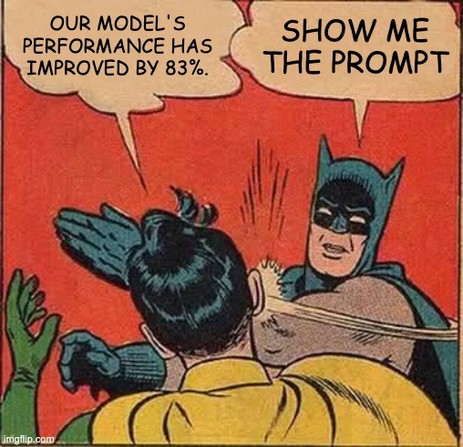

# Show Me the Prompt
[](https://www.cursor.sh)  [](https://chat.openai.com)
> “Talk is cheap. Show me the code.” — Linus Torvalds  
> But in 2025, talk *is* the code. So — **show me the prompt.**

## 🚀 What's This?

This is a prompt repo.

Not a prompt zoo.  
Not a prompt graveyard.  
Not a "2000 ChatGPT tricks you can't miss" list.

Just a home for:
- Prompts that actually work
- Prompt patterns that make sense
- Prompt ideas that age like wine

Because these days, writing a good prompt feels like casting a spell.  
And hey, wizards need a spellbook.

## 🧠 Background

Linus once said:  
> “Talk is cheap. Show me the code.” [Linus Torvalds, LKML, 2000](https://lkml.org/lkml/2000/8/25/132)

That made sense — back when code was king.

Now?  
We whisper to the machines, and they *understand*.

Prompts are the new code.  
The prompt engineer is the new wizard.  
And GitHub... well, GitHub is still GitHub.

So here we are:  
> **Show me the prompt.**

## 🗂️ Repo Structure
```
📁 prompts/
├── 🎨 creativity/
│ └── writing_as_thinking.md
├── 👨‍⚕️ roles/
│ └── AI_therapist_prompt.txt
├── 🧠 thinking/
│ └── tree_of_thought_prompt.md
├── 💼 workflows/
│ └── research_chain_agent.md
├── 📚 methods/
│ └── chained_prompt_blocks.md
└── README.md
```

Each file should include:

- What it does
- When to use
- The prompt
- Sample output (optional)
- Credit / author / origin

## 🛠️ How to Contribute

> Initial prompt: Help me create the project structure as the README said

We welcome:

- 🔹 Prompts you’ve battle-tested and loved  
- 🔸 Prompt design methods / templates  
- 🔹 Ideas or insights about prompt logic  
- 🔸 Links to great papers, tools, or rants

Pull requests welcome. Spells without context? Not so much.

## 📬 License & Philosophy

CC BY 4.0.  
Steal like an artist, credit like a pro.
<p align="center">
  
</p>
---

Prompts are the new shell scripts.  
Let’s make them readable, reusable, and ridiculous.

---